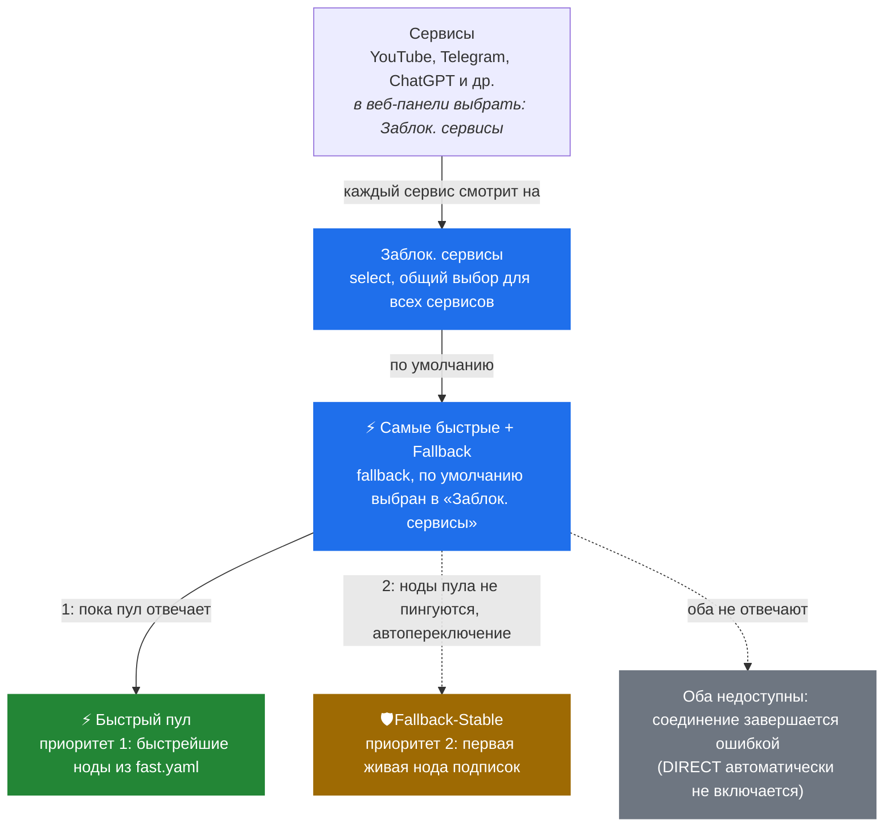

# Mihomo-Speedtest

<p align="center">
  
</p>

Надстройка для роутеров Keenetic с XKeen и ядром Mihomo. Она решает две задачи:

- **Выбирает ноды по реальной скорости.** Раз в 3 часа скачивает тестовый
  файл через ноды ваших подписок и собирает из самых быстрых группу
  `⚡ Быстрый пул` (`fast.yaml`). Mihomo продолжает обслуживать трафик во
  время замера.
- **Ведёт статистику доступности.** На каждом прогоне отмечает, какие ноды
  ответили, и показывает историю: самые живые сверху, у каждой - аптайм и
  лента «жива / не ответила» по прогонам.

<p align="center">
  
</p>
<p align="center"><sub>Вкладка «Статистика», демонстрационные данные</sub></p>

**[Установка](#установка)** ·
**[Руководство](docs/guide.md)** ·
**[Как устроен замер](docs/guide.md#speedtest-измеряем-реальную-скорость-а-не-пинг)** ·
**[Удаление](docs/guide.md#деинсталляция)**

## Зачем

Штатный `url-test` выбирает ноду по задержке, но низкий пинг не гарантирует
скорость: сервер с задержкой 40 мс может отдавать данные медленнее сервера
с задержкой 90 мс. А по одному замеру не видно, какие ноды подписки
пропадают через раз. Mihomo-Speedtest меряет скорость загрузки и копит
историю доступности, поэтому видно и кто быстрый сейчас, и на кого можно
положиться.

## Преимущества

- **Конструктор конфига.** Прямо в веб-панели `config.yaml` собирается и
  правится визуально, не нужно вручную редактировать YAML по SSH.
- **Импорт WireGuard из файла.** Загрузите обычные `.conf` (в том числе
  AmneziaWG): они распознаются и прописываются в конфиг как ноды, а имена
  добавляются в группы выбора. Перед применением конфиг проходит `mihomo -t`.
- **Гибкая работа с исключениями.** Страны нод, которые не нужно проверять
  и брать в группы, отключаются галочками в конструкторе; порты и адреса,
  которые не должны идти через прокси, - на вкладке «XKeen».
- **Не нагружает роутер.** Лёгкость заложена в архитектуру: прогон раз в
  3 часа, проверки групп ленивые (`lazy: true`), веб-сервис - один
  процесс на Python, а временные данные (живой журнал, прогресс, сессии)
  лежат в `tmpfs`. На USB-накопитель пишется только то, что нужно хранить
  между перезагрузками, поэтому процессор, память и флешка почти не
  нагружаются.

### О скоростях WireGuard на разных роутерах

По опыту автора, скорость WireGuard-нод на роутерах с процессором `mipsel`
замеряется примерно в 4 раза ниже, чем на `aarch64`: шифрование делает
процессор роутера, и слабый CPU упирается в себя, а не в канал. Поэтому
сравнивайте скорости нод между собой на одном роутере, а не с цифрами с
другой модели: порог отбора калибруется по скорости прямого подключения
именно вашего роутера. Абсолютные значения на `mipsel` будут скромнее.

## Что умеет

**Скорость и быстрый пул**

- Замер реальной загрузки через установленное ядро Mihomo - те же
  транспорты, что и в работе, включая WireGuard/AmneziaWG.
- Порог отбора калибруется по скорости прямого подключения; `fast.yaml`
  заменяется атомарно, только после проверки.

**Статистика доступности**

- Лента доступности: строка на ноду, клетка на прогон, аптайм в процентах.
- Таблица нод: статус, когда последний раз была жива, аптайм, средняя и
  текущая скорость; сортировка и фильтр по статусу.
- История прогонов: скорость канала, порог, сколько нод живо и прошло отбор.

**Веб-панель** (`http://<IP роутера>:8899/`, вход по логину и паролю)

- Настройки отбора с подробными подсказками, запуск прогона кнопкой.
- Редактор `config.yaml` с проверкой `mihomo -t`, бэкапами и автооткатом,
  если ядро не поднялось.
- Вкладка «XKeen»: исключения портов и адресов, порты проксирования и
  `xkeen.json` с проверкой формата, бэкапами и автооткатом; кнопки команд
  XKeen (статус, перезапуск, диагностика, геобазы и др.) с выводом в окно,
  как в консоли.
- Живой журнал прогона и обновление проекта в один клик.
- Раздел «Обновления» показывает версии ядра mihomo, zashboard и XKeen,
  проверяет их по расписанию и обновляет ядро и zashboard кнопкой (с
  автооткатом ядра); XKeen - только уведомление о новой версии.

**Настройка Mihomo с нуля** - мастер `setup.sh` собирает конфиг из
подписок: подбирает User-Agent, предлагает имена провайдеров.

## Как проходит прогон

1. Ноды берутся из подписок, гео-фильтр отсекает лишние страны.
2. Отдельный экземпляр Mihomo проверяет, какие ноды отвечают, - это
   попадает в статистику доступности.
3. Через живые ноды скачивается тестовый файл.
4. Ноды быстрее порога записываются в `fast.yaml`; внутри `⚡ Быстрого пула`
   Mihomo сам выбирает ноду с лучшим пингом.
5. Результаты сохраняются в историю для ленты доступности и таблицы нод.

Подробно об алгоритме и параметрах - в
[руководстве](docs/guide.md#speedtest-измеряем-реальную-скорость-а-не-пинг).

## Рекомендации из опыта

**Сначала настройте DNS на роутере.** Замеры и подписки зависят от
корректного DNS, поэтому до установки:

1. Настройте DNS на роутере и убедитесь, что в логах DoH/DoT не сыплются
   ошибки.
2. Проверьте подмену DNS проектом
   [dpi-detector](https://github.com/Runnin4ik/dpi-detector), запустив его
   на самом роутере.

**Отказоустойчивость нод не гарантирована между провайдерами.** Одна и та
же нода одного сервиса может стабильно работать через одного
интернет-провайдера и пропадать через другого, поэтому статистику
доступности стоит смотреть на своём роутере, а не переносить чужие выводы.
Подписку на VLESS, которой пользуются многие, на сегодня блокируют чаще,
чем AmneziaWG. По проведённой статистике WG-ноды сейчас живут дольше всех.

## Установка

| Нужно | Минимальная версия |
|---|---|
| Keenetic с USB-накопителем и Entware, доступ по SSH под root | KeeneticOS 5.1.4 |
| XKeen с ядром Mihomo | XKeen 2.0, Mihomo 1.19.29 |
| 1-3 подписки в формате Clash YAML | - |

Одна команда по SSH на роутере:

```sh
curl -fsSL https://raw.githubusercontent.com/f0nwa/mihomo-speedtest/main/install.sh | sh
```

Установщик скачивает проверенный релиз (SHA256 каждого файла), затем
запускает мастер настройки, если `config.yaml` ещё нет, или сразу ставит
замеры к готовому конфигу. В конце он печатает адрес веб-панели и
одноразовый код для создания логина и пароля. Версии проверяются заранее:
если требования не выполнены, установка останавливается.

Установщик показывает шаги с галочками и прогрессом; подробный журнал
остаётся в `/opt/var/log/mihomo-speedtest-install.log` - пришлите его, если
что-то пошло не так. Нужен простой текст без цветов (например, для записи
вывода) - запустите с `NO_COLOR=1` или `UI=plain`: `NO_COLOR=1 sh install.sh`.

В начале установщик спрашивает канал обновлений: стабильный (по умолчанию)
или разработка (dev) - новые функции раньше, но возможны ошибки. Выбрать
dev сразу, без вопроса:

```sh
curl -fsSL https://raw.githubusercontent.com/f0nwa/mihomo-speedtest/main/install.sh | UPDATE_CHANNEL=dev sh
```

Канал потом меняется в веб-интерфейсе, вкладка «Обновления».

Для обновления по SSH выполните `mihomo-speedtest update`: команда сама
проверит релиз, задаст необходимые вопросы и установит обновление.

Установка без интернета на роутере, ручной перенос файлов и обновление -
в [руководстве](docs/guide.md#установка-с-нуля). Удалить всё (службу,
cron, при желании откатить `config.yaml`):

```sh
curl -fsSL https://raw.githubusercontent.com/f0nwa/mihomo-speedtest/main/uninstall.sh | sh
```

## Рекомендуемая настройка сервисов

В веб-панели у каждого сервиса (YouTube, Telegram и др.) выберите группу
`Заблок. сервисы`. Она по умолчанию смотрит на `⚡ Самые быстрые + Fallback`,
а та - на две группы: `⚡ Быстрый пул` (приоритет 1) и `🛡️Fallback-Stable`
(приоритет 2). Если ноды быстрого пула перестают пинговаться, Mihomo сам
переключается на `🛡️Fallback-Stable` - так настроена отказоустойчивость.



## Каналы обновлений

В репозитории две ветки: `main` - стабильная, `dev` - разработка. Выпуски
из `main` помечены тегами с чётным вторым числом (1.0.0, 1.2.1), из `dev` -
с нечётным (1.1.0, 1.3.0). По умолчанию роутер получает только стабильные
релизы. Если хотите новые функции раньше, откройте веб-панель, раздел
«Обновления», карточка «Настройки обновлений», и в поле «Канал обновлений»
выберите «Разработка» - dev-сборки новее, но могут содержать ошибки. Вернуться на
«Стабильный» можно в любой момент, но роутер останется на текущей версии,
пока не выйдет стабильный релиз новее. Команда установки не меняется:
`install.sh` всегда ставит стабильный релиз и при переустановке сохраняет
выбранный канал.

Обновление проекта рабочий config.yaml не трогает. Если в новом релизе
изменился шаблон конфига, в разделе «Обновления» появляется отдельная
карточка «Доступно обновление конфига»: кнопка «Обновить конфиг» открывает
редактор с результатом миграции к шаблону, его проверяют и применяют.
Карточка висит, пока конфиг не мигрирован.

## Безопасность и ограничения

- Веб-панель и API закрыты входом, но HTTPS нет: держите порт `8899` (как и
  `9090`) только в локальной сети или за VPN, не открывайте в интернет.
- Для веб-панели нужен Python 3 (установщик ставит его через Entware). Без
  него замеры работают, панель не запускается.
- Замеры расходуют трафик и ресурсы роутера; размер файла, таймауты и
  число проверяемых нод настраиваются.
- Рабочий `config.yaml` содержит ссылки подписок и пароли - не публикуйте его.

## Документация

| Задача | Где читать |
|---|---|
| Установить, обновить, удалить | [Установка с нуля](docs/guide.md#установка-с-нуля), [обновление из релизов](docs/guide.md#управляемое-обновление-из-релизов-updatesh), [деинсталляция](docs/guide.md#деинсталляция) |
| Настроить замеры и отбор | [Speedtest](docs/guide.md#speedtest-измеряем-реальную-скорость-а-не-пинг) |
| Веб-панель | [Служба](docs/guide.md#независимая-служба-веб-интерфейса-статистики), [вход](docs/guide.md#обязательная-авторизация-веб-интерфейса), [обновления](docs/guide.md#раздел-обновления-в-веб-интерфейсе), [журнал](docs/guide.md#вкладка-журнал-в-веб-интерфейсе), [редактор конфига](docs/guide.md#редактор-конфига-вкладка-конфиг), [списки и команды XKeen](docs/guide.md#списки-xkeen-вкладка-xkeen) |
| Правила, группы и режимы | [Маршрутизация](docs/guide.md#как-работает-маршрутизация), [группы прокси](docs/guide.md#основные-группы-прокси), [режимы](docs/guide.md#режимы-mihomo) |
| Подключить подписку | [Провайдеры и User-Agent](docs/guide.md#провайдеры) |
| Найти причину сбоя | [Проверка результата](docs/guide.md#проверка-результата), [известные проблемы](docs/guide.md#известные-проблемы) |

[config.example.yaml](config-tools/config.example.yaml) - обезличенный шаблон
конфига, созданный на основе конфигуратора rockblack и доработанный автором
проекта.

## Благодарности

- [misuk1](https://github.com/misuk1) - за идею `speedtest2.fast.yaml` и
  awk-обработки.

## Команды

После установки всем управляют по SSH одной командой `mihomo-speedtest`:

| Команда | Что делает |
|---|---|
| `mihomo-speedtest reset-password` | **забыли пароль от веб-панели**: печатает одноразовый код, с ним на странице `/setup` задаёте новые логин и пароль |
| `mihomo-speedtest show-url` | показать адрес веб-панели |
| `mihomo-speedtest run` | запустить замер скорости прямо сейчас |
| `mihomo-speedtest update` | проверить и установить обновление |
| `mihomo-speedtest status` | состояние веб-службы |
| `mihomo-speedtest restart-web` | перезапустить веб-панель, если не открывается |
| `mihomo-speedtest stop-web` / `start-web` | выключить / включить веб-панель |
| `mihomo-speedtest setup` | мастер настройки `config.yaml` |
| `mihomo-speedtest version` | установленная версия |
| `mihomo-speedtest recalibrate` | пересчитать порог скорости |
| `mihomo-speedtest install` / `uninstall` | переустановить / удалить проект |

Список всех команд: `mihomo-speedtest help`.

Лицензия - [MIT](LICENSE).
