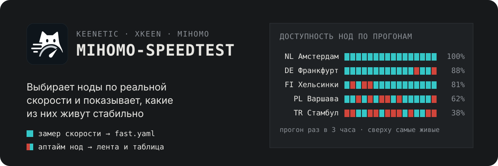
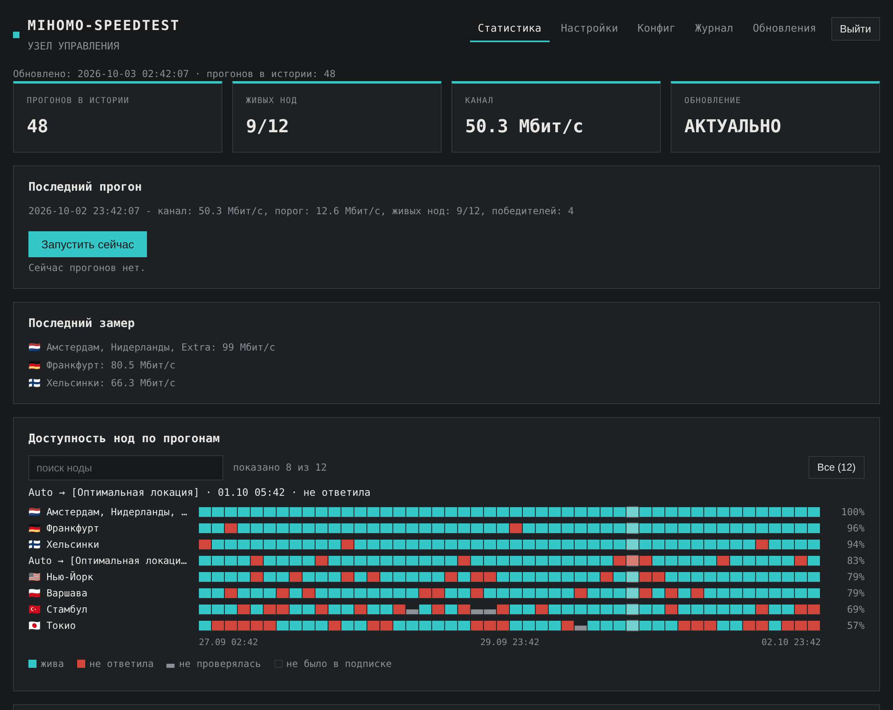

# Mihomo-Speedtest

<p align="center">
  
</p>

Надстройка для роутеров Keenetic с XKeen и ядром Mihomo. Она решает две задачи:

- **Выбирает ноды по реальной скорости.** Раз в 3 часа скачивает тестовый
  файл через ноды ваших подписок и собирает из самых быстрых группу
  `⚡ Быстрый пул` (`fast.yaml`). Mihomo продолжает обслуживать трафик во
  время замера.
- **Ведёт статистику доступности.** На каждом прогоне отмечает, какие ноды
  ответили, и показывает историю: самые живые сверху, у каждой - аптайм и
  лента «жива / не ответила» по прогонам.

<p align="center">
  
</p>
<p align="center"><sub>Вкладка «Статистика», демонстрационные данные</sub></p>

**[Установка](#установка)** ·
**[Руководство](docs/guide.md)** ·
**[Как устроен замер](docs/guide.md#speedtest-измеряем-реальную-скорость-а-не-пинг)** ·
**[Удаление](docs/guide.md#деинсталляция)**

## Зачем

Штатный `url-test` выбирает ноду по задержке, но низкий пинг не гарантирует
скорость: сервер с задержкой 40 мс может отдавать данные медленнее сервера
с задержкой 90 мс. А по одному замеру не видно, какие ноды подписки
пропадают через раз. Mihomo-Speedtest меряет скорость загрузки и копит
историю доступности, поэтому видно и кто быстрый сейчас, и на кого можно
положиться.

## Что умеет

**Скорость и быстрый пул**

- Замер реальной загрузки через установленное ядро Mihomo - те же
  транспорты, что и в работе, включая WireGuard/AmneziaWG.
- Порог отбора калибруется по скорости прямого подключения; `fast.yaml`
  заменяется атомарно, только после проверки.
- Гео-фильтр: ноды каких стран не проверять, выбирается галочками.

**Статистика доступности**

- Лента доступности: строка на ноду, клетка на прогон, аптайм в процентах.
- Таблица нод: статус, когда последний раз была жива, аптайм, средняя и
  текущая скорость; сортировка и фильтр по статусу.
- История прогонов: скорость канала, порог, сколько нод живо и прошло отбор.

**Веб-панель** (`http://<IP роутера>:8899/`, вход по логину и паролю)

- Настройки отбора с подробными подсказками, запуск прогона кнопкой.
- Редактор `config.yaml` с проверкой `mihomo -t`, бэкапами и автооткатом,
  если ядро не поднялось.
- Вкладка «XKeen»: исключения портов и адресов, порты проксирования и
  `xkeen.json` с проверкой формата, бэкапами и автооткатом; кнопки команд
  XKeen (статус, перезапуск, диагностика, геобазы и др.) с выводом в окно,
  как в консоли.
- Живой журнал прогона и обновление проекта в один клик.

**Настройка Mihomo с нуля** - мастер `setup.sh` собирает конфиг из
подписок: подбирает User-Agent, предлагает имена провайдеров.

## Как проходит прогон

1. Ноды берутся из подписок, гео-фильтр отсекает лишние страны.
2. Отдельный экземпляр Mihomo проверяет, какие ноды отвечают, - это
   попадает в статистику доступности.
3. Через живые ноды скачивается тестовый файл.
4. Ноды быстрее порога записываются в `fast.yaml`; внутри `⚡ Быстрого пула`
   Mihomo сам выбирает ноду с лучшим пингом.
5. Результаты сохраняются в историю для ленты доступности и таблицы нод.

Подробно об алгоритме и параметрах - в
[руководстве](docs/guide.md#speedtest-измеряем-реальную-скорость-а-не-пинг).

## Установка

| Нужно | Минимальная версия |
|---|---|
| Keenetic с USB-накопителем и Entware, доступ по SSH под root | KeeneticOS 5.1.4 |
| XKeen с ядром Mihomo | XKeen 2.0, Mihomo 1.19.29 |
| 1-3 подписки в формате Clash YAML | - |

Одна команда по SSH на роутере:

```sh
curl -fsSL https://raw.githubusercontent.com/f0nwa/mihomo-speedtest/main/install.sh | sh
```

Установщик скачивает проверенный релиз (SHA256 каждого файла), затем
запускает мастер настройки, если `config.yaml` ещё нет, или сразу ставит
замеры к готовому конфигу. В конце он печатает адрес веб-панели и
одноразовый код для создания логина и пароля. Версии проверяются заранее:
если требования не выполнены, установка останавливается.

Установка без интернета на роутере, ручной перенос файлов и обновление -
в [руководстве](docs/guide.md#установка-с-нуля). Удалить всё (службу,
cron, при желании откатить `config.yaml`):

```sh
curl -fsSL https://raw.githubusercontent.com/f0nwa/mihomo-speedtest/main/uninstall.sh | sh
```

## Каналы обновлений

В репозитории две ветки: `main` - стабильная, `dev` - разработка. Выпуски
из `main` помечены тегами с чётным вторым числом (1.0.0, 1.2.1), из `dev` -
с нечётным (1.1.0, 1.3.0). По умолчанию роутер получает только стабильные
релизы. Если хотите новые функции раньше, откройте веб-панель, раздел
«Настройки», группа «Обновления», и в поле «Канал обновлений» выберите
«Разработка» - dev-сборки новее, но могут содержать ошибки. Вернуться на
«Стабильный» можно в любой момент, но роутер останется на текущей версии,
пока не выйдет стабильный релиз новее. Команда установки не меняется:
`install.sh` всегда ставит стабильный релиз и при переустановке сохраняет
выбранный канал.

## Безопасность и ограничения

- Веб-панель и API закрыты входом, но HTTPS нет: держите порт `8899` (как и
  `9090`) только в локальной сети или за VPN, не открывайте в интернет.
- Для веб-панели нужен Python 3 (установщик ставит его через Entware). Без
  него замеры работают, панель не запускается.
- Замеры расходуют трафик и ресурсы роутера; размер файла, таймауты и
  число проверяемых нод настраиваются. Временные файлы лежат в `/tmp`,
  на USB-накопитель пишется только итог прогона.
- Рабочий `config.yaml` содержит ссылки подписок и пароли - не публикуйте его.

## Документация

| Задача | Где читать |
|---|---|
| Установить, обновить, удалить | [Установка с нуля](docs/guide.md#установка-с-нуля), [обновление из релизов](docs/guide.md#управляемое-обновление-из-релизов-updatesh), [деинсталляция](docs/guide.md#деинсталляция) |
| Настроить замеры и отбор | [Speedtest](docs/guide.md#speedtest-измеряем-реальную-скорость-а-не-пинг) |
| Веб-панель | [Служба](docs/guide.md#независимая-служба-веб-интерфейса-статистики), [вход](docs/guide.md#обязательная-авторизация-веб-интерфейса), [обновления](docs/guide.md#раздел-обновления-в-веб-интерфейсе), [журнал](docs/guide.md#вкладка-журнал-в-веб-интерфейсе), [редактор конфига](docs/guide.md#редактор-конфига-вкладка-конфиг), [списки и команды XKeen](docs/guide.md#списки-xkeen-вкладка-xkeen) |
| Правила, группы и режимы | [Маршрутизация](docs/guide.md#как-работает-маршрутизация), [группы прокси](docs/guide.md#основные-группы-прокси), [режимы](docs/guide.md#режимы-mihomo) |
| Подключить подписку | [Провайдеры и User-Agent](docs/guide.md#провайдеры) |
| Найти причину сбоя | [Проверка результата](docs/guide.md#проверка-результата), [известные проблемы](docs/guide.md#известные-проблемы) |

[config.example.yaml](config-tools/config.example.yaml) - обезличенный шаблон
конфига, созданный на основе конфигуратора rockblack и доработанный автором
проекта.

Лицензия - [MIT](LICENSE).
